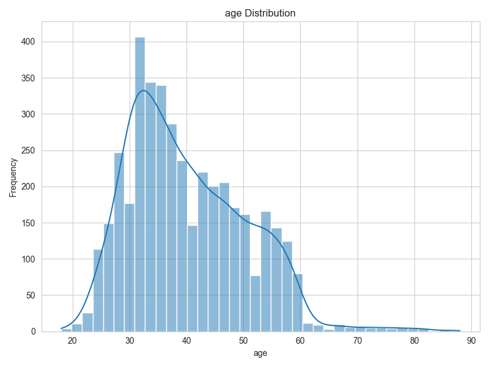
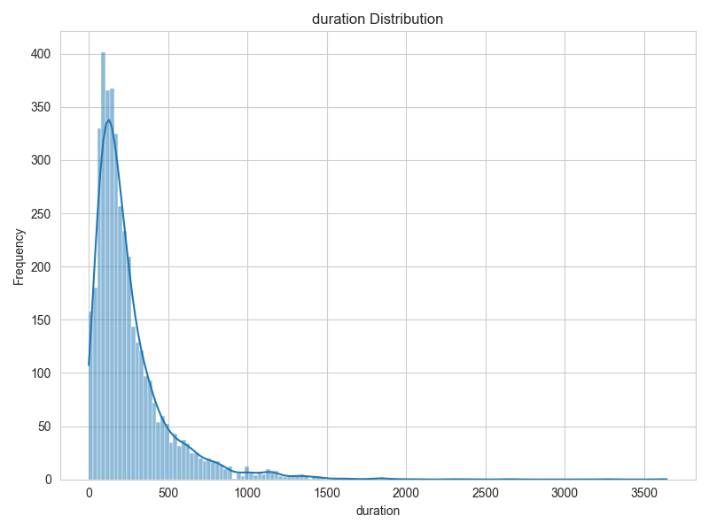
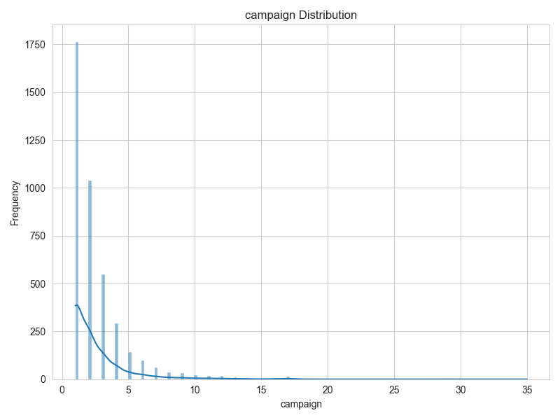
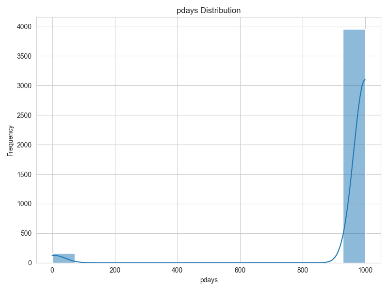
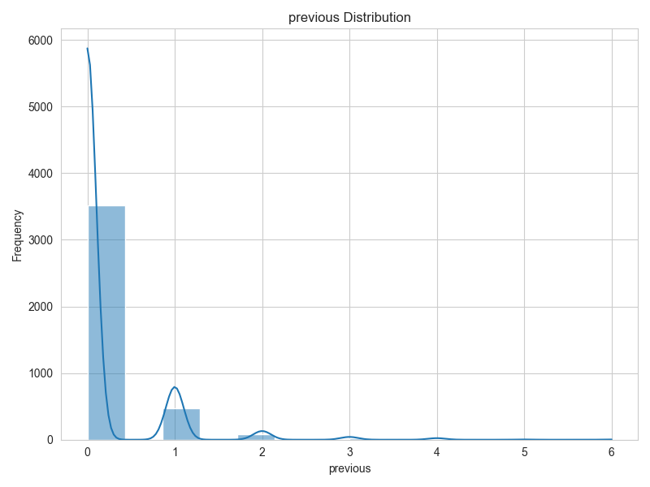
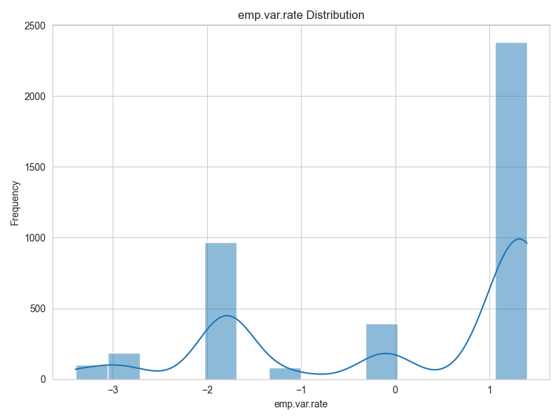
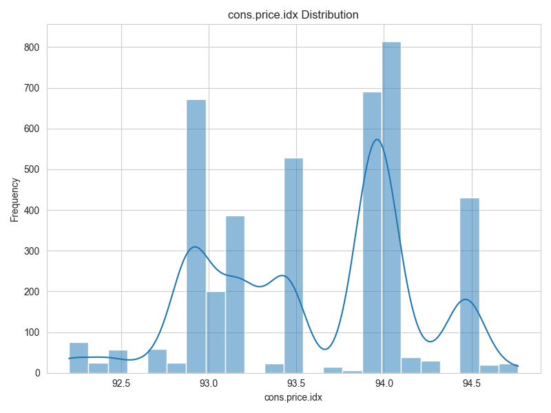
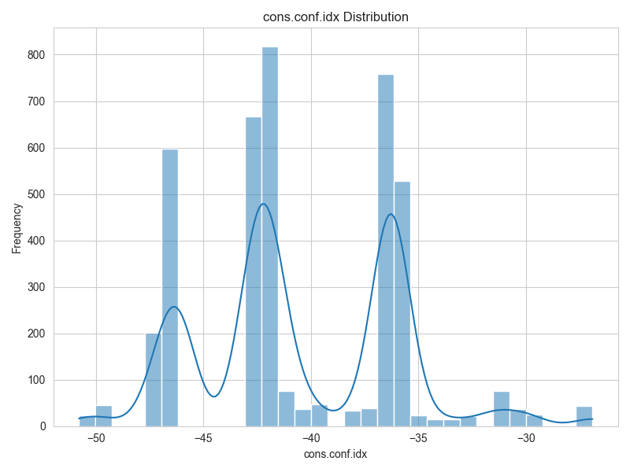
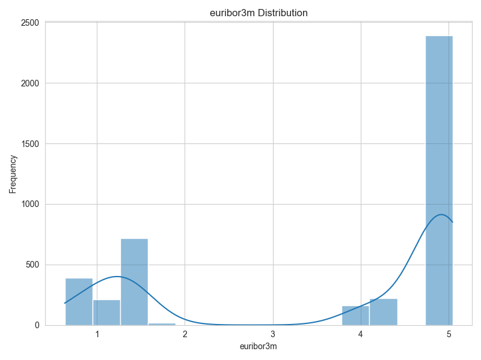
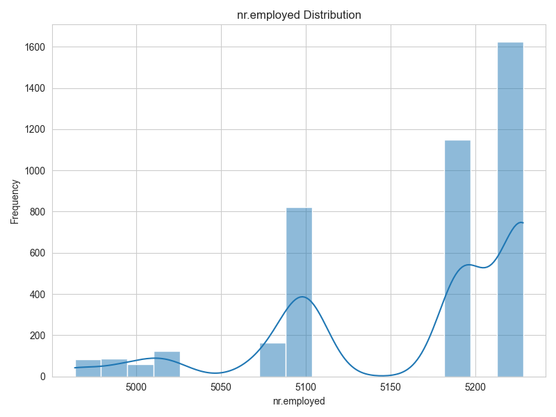

### **Executive Summary**
---
This project focuses on developing and assessing predictive models to enhance customer subscription rates for long-term deposit products in a marketing campaign. The process includes data preprocessing, exploratory data analysis (EDA), model training, and performance evaluation.

**Data**: 4,119 examples, 21 features, 1,230 missing entries.

**Best Model**: Tuned SVM with 98.77% test accuracy and 0.9973 ROC AUC.

**Decision Tree**: Second place (94.55%), very fast but prone to overfitting.

**KNN**: 90.94% test accuracy, also near-perfect fit on training.

**Logistic Regression**: 74.66% accuracy, stable and interpretable, but lags behind tree/kernel-based models.

## **Recommendation**

Utilize SVM for best performance or Decision Tree for speed with minimal performance drop.

While SVM is the champion, it’s also the slowest. Running the code on the larger version of the dataset was canceled after over 12 hours of processing and would require distributed training or more computational resources to complete.

---

**Overview**
---
In this analysis, I explore how to predict potential subscriptions to a long-term deposit product using new data (4,119 records, 21 columns) from a Portuguese bank marketing campaign. I chose the smaller dataset as there weren’t significant changes to the training ac**ANALYSIS COMPARISON**

The pipeline involves data cleaning, exploratory data analysis (EDA), various classification models, and hyperparameter tuning.

**Data Description**
**Shape**: (4119, 21)
**Null Values**: 1230 missing entries
**Column Data Types**:
11 object (categorical)
5 int64 (integer)
5 float64 (numeric/floating)

### Numerical Features
	•	age: Age of the customer
	•	duration: Last contact duration in seconds
	•	campaign: Number of contacts performed during this campaign
	•	pdays: Number of days since the client was last contacted
	•	previous: Number of contacts performed before this campaign
	•	emp.var.rate: Employment variation rate
	•	cons.price.idx: Consumer price index
	•	cons.conf.idx: Consumer confidence index
	•	euribor3m: Euribor 3-month rate
	•	nr.employed: Number of employees

**Key Numerical Features**:
	* 	age, campaign, pdays, previous, emp.var.rate, cons.price.idx, cons.conf.idx, euribor3m, nr.employed, etc.

**Key Categorical Features**:
	* 	job, marital, education, default, housing, loan, contact, month, day_of_week, poutcome

**Summary of Notable Distributions**
	* 	**job**: ~24.57% admin., 21.46% blue-collar, 16.78% technician, etc.
	* 	**housing**: ~52.80% yes, ~44.65% no, ~2.55% missing (NaN)
	* 	**loan**: ~81.31% no, ~16.14% yes, ~2.55% missing
	* 	**target (y)**: Split was roughly 11% “yes” vs. 89% “no” before upsampling.
	* 	**Baseline Dummy Classifier**: 0.50 accuracy with upsampled data.

**Exploratory Data Analysis (EDA)**
---
	* 	**Shape & Missingness**: With 4,119 rows and 21 columns, there are 1,230 missing values spread mostly in default, housing, loan, and some education.
	* 	**Numerical Stats**:
	* 	Average age is ~40, ranging 18–88.
	* 	duration (excluded for real modeling) was originally up to ~3,600 seconds.
	* 	euribor3m & emp.var.rate strongly correlate with economic conditions.
	* 	**Categorical Distributions**:
	* 	“admin.” job is largest (24.57%), “blue-collar” next (21.46%).
	* 	“married” is the largest marital category (60.91%), with ~0.27% missing.
	* 	**Target Variable**: For the raw data, ~11% “yes” to term deposit vs. ~89% “no”, but an upsampling approach balanced classes to 50/50 in the training set.

## **Numerical Features**

### **Age of the customer**

**Descriptive Statistics for age:**
{'count': 4119.0, 'mean': 40.11361981063365, 'std': 10.313361547199813, 'min': 18.0, '25%': 32.0, '50%': 38.0, '75%': 47.0, 'max': 88.0}

**Shape:** Right-skewed, with most ages clustering between the late 20s and early 40s.

**Implication:** The population skews younger to middle-aged, but there are still some older customers in the dataset.

---

### **Last contact duration in seconds**

**Descriptive Statistics for duration:**
{'count': 4119.0, 'mean': 256.7880553532411, 'std': 254.70373612073678, 'min': 0.0, '25%': 

**Shape:** Strongly right-skewed, with a large majority of call durations under ~500 seconds and a very long tail of longer calls.

**Implication:** Most calls are relatively short, but a small number can last much longer.

---

### **Number of contacts performed during this campaign**

**Descriptive Statistics for campaign:**
{'count': 4119.0, 'mean': 2.537266326778344, 'std': 2.568159237578138, 'min': 1.0, '25%': 1.0, '50%': 2.0, '75%': 3.0, 'max': 35.0}

**Shape:** Heavily right-skewed, with most clients contacted fewer than ~5 times, and a small fraction contacted many more times.

**Implication:** The typical client receives a limited number of calls, but some clients have been contacted very frequently.

---

### **Number of days since the client was last contacted**

**Descriptive Statistics for pdays:**
{'count': 4119.0, 'mean': 960.4221898519058, 'std': 191.92278580077644, 'min': 0.0, '25%': 999.0, '50%': 999.0, '75%': 999.0, 'max': 999.0}

**Shape:** Nearly all values are around 999, indicating most clients had not been previously contacted or had a large gap since last contact. A small portion has pdays near zero or other small numbers.

**Implication:** The majority are “new” contacts for this campaign (or far removed from past campaigns).

---

### **Number of contacts performed before this campaign**

**Descriptive Statistics for previous:**
{'count': 4119.0, 'mean': 0.19033746054867687, 'std': 0.5417883234290308, 'min': 0.0, '25%': 0.0, '50%': 0.0, '75%': 0.0, 'max': 6.0}

**Shape:** Dominated by 0 (no previous contacts), with a small portion of 1 or 2, and very few above 2.

**Implication:** Most customers did not have contacts in earlier campaigns.

---

### **Employment variation rate**

**Descriptive Statistics for emp.var.rate:**
{'count': 4119.0, 'mean': 0.08497208060208788, 'std': 1.5631144559116763, 'min': -3.4, '25%': -1.8, '50%': 1.1, '75%': 1.4, 'max': 1.4}

**Shape:** Shows distinct peaks around −2 and +1.4, indicating certain economic conditions were more common in the data.

**Implication:** Economic circumstances varied but often clustered around these two states.

---

### **Consumer price index**

**Descriptive Statistics for cons.price.idx:**
{'count': 4119.0, 'mean': 93.57970429715951, 'std': 0.5793488049889662, 'min': 92.201, '25%': 93.075, '50%': 93.749, '75%': 93.994, 'max': 94.767}

**Shape:** Multiple peaks between ~92.5 and 94.5, reflecting different “clusters” of consumer price index values over time.

**Implication:** The CPI shifted in steps, possibly tied to different periods in the dataset.

---

### **Consumer confidence index**

**Descriptive Statistics for cons.conf.idx:**
{'count': 4119.0, 'mean': -40.49910172371935, 'std': 4.594577506837543, 'min': -50.8, '25%': -42.7, '50%': -41.8, '75%': -36.4, 'max': -26.9}

**Shape:** Multiple peaks roughly between −50 and −35, showing a few dominant confidence levels.

**Implication:** Consumer confidence was generally negative, fluctuating within a limited range.

---

### **Euribor 3-month rate**

**Descriptive Statistics for eurobor3m:**
{'count': 4119.0, 'mean': 3.621355668851663, 'std': 1.7335912227013557, 'min': 0.635, '25%': 1.334, '50%': 4.857, '75%': 4.961, 'max': 5.045}

**Shape:** Two main clusters—one around ~1 and another near ~5—indicating interest rates were either quite low or relatively high, with a “gap” in the middle.

**Implication:** Distinct macroeconomic environments during the observed periods.

---

### **Number of employees**

**Descriptive Statistics for nr.employed:**
{'count': 4119.0, 'mean': 5166.481694586065, 'std': 73.66790355721253, 'min': 4963.6, '25%': 5099.1, '50%': 5191.0, '75%': 5228.1, 'max': 5228.1}

**Shape:** Bimodal, with large peaks around ~5100 and ~5200, and smaller peaks under 5000.

**Implication:** Employment figures changed sharply over time, suggesting different labor-market conditions across the dataset.

---

## **Modeling Approaches**
---

I used **four classifiers**:
	1.	**Logistic Regression**
	2.	**Decision Tree**
	3.	**K-Nearest Neighbors (KNN)**
	4.	**Support Vector Machine (SVM)**

**Imbalanced Data**
Before training, I upsampled the minority class to handle the imbalance. Then I split data (80/20) into train/test sets.

**Evaluation Metrics**
	* 	Accuracy
	* 	ROC AUC
	* 	Precision, Recall, F1 (seen in classification reports)

**Default Results**
---
I obtained the follwing results using the default settings for the models.

**Key Observations**:
	* 	**Decision Tree** is extremely accurate on training (99.97%) and very strong on test (94.55%), indicating some overfitting.
	* 	**KNN** also shows high train accuracy (90.08%) but drops to 85.90% on test.
	* 	**Logistic Regression** is more balanced, ~74.66% test accuracy, with a moderate ROC AUC (~0.7966).
	* 	**SVM** with default hyperparameters underperforms the Decision Tree and KNN in test accuracy (79.63%).

**6. Hyperparameter Tuning Resultes**
The following results were achieved after hyperparameter tuning.

**Findings**:
	* 	**SVM** soared after tuning, reaching **98.77%** test accuracy and **0.9973 ROC AUC**, the best overall.
	* 	**Decision Tree** remains second at **94.55%** test accuracy.
	* 	**KNN** improved to **90.94%** test accuracy.
	* 	**Logistic Regression** stays around **74.66%**, still stable but behind the tree-based or kernel-based methods.

**7. Insights into the New Data and Results**
	1.	**Shape & Missingness**: With 4,119 records, the dataset is moderately sized; 1,230 nulls highlight the importance of careful imputation (especially for default, housing, loan, and some education).
	2.	**Class Distribution**: The raw data is heavily skewed toward “no,” but upsampling balanced the training set.
	3.	**SVM** emerges as the best performer with near-perfect test accuracy (98.77%) and ~1.00 ROC AUC, though it requires **longer training** (over 60 seconds in tuning).
	4.	**Decision Tree** is simpler and very fast to train, scoring around 94.55% on the test set, but it overfits drastically (nearly 100% on training).
	5.	**KNN** also hits perfect training accuracy but dips to ~90.94% test.
	6.	**Logistic Regression** remains the most interpretable, though with modest ~74.66% test accuracy, it might be favored for speed and transparency in certain business contexts.

**Business Recommendations**
---
	* 	**Use SVM** if maximum predictive power is desired and computation time is acceptable.
	* 	**Watch for Overfitting** in the Decision Tree and KNN; while these show strong test performance, they can degrade if future data differs from the training set.
	* 	**Focus on Data Quality**: 1,230 missing entries are significant; refining or collecting missing info could further improve results.
	* 	**Leverage Economic Indicators** (emp.var.rate, euribor3m) and call features (e.g., duration) more explicitly—SVM permutations indicate these are key.
	* 	**Iterate** with advanced feature engineering, model ensembles, or time-series analysis for additional gains.

### New Report Summary
	* 	**New Data**: 4,119 examples, 21 features, 1,230 missing entries.
	* 	**Best Model**: Tuned SVM with 98.77% test accuracy and 0.9973 ROC AUC.
	* 	**Decision Tree**: Second place (94.55%), very fast but prone to overfitting.
	* 	**KNN**: 90.94% test accuracy, also near-perfect fit on training.
	* 	**Logistic Regression**: 74.66% accuracy, stable and interpretable, but lags behind tree/kernel-based models.
	* 	**Recommendation**: SVM for best performance or Decision Tree for speed with minimal performance drop.

### 5. Additional Insight About the New Data
	1.	**Null Values**: With 1,230 missing values out of 4,119 records (~30%), proper imputation or domain-driven treatment is critical to ensure robust models. A large portion of these come from placeholders like “unknown” in columns default, housing, loan, and education.
	2.	**Stronger Economic Shifts**: The emp.var.rate has a wider range here (−3.4 to +1.4), suggesting data covering significant economic fluctuations. High variance in these indicators often boosts the value of SVM, which handles complex boundaries.
	3.	**Improved Gains with Tuning**: The SVM’s jump from 79.63% to 98.77% test accuracy underscores how **crucial** hyperparameter tuning can be—particularly for advanced algorithms like SVM.
	4.	**Scalability**: 

---
#Module17
