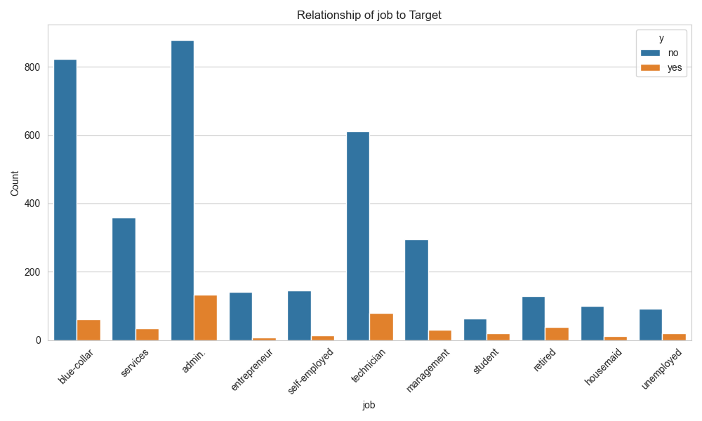

**Executive Summary**
---
The goal of this project is to increase long-term deposit accounts through advanced predictive analytics. I analyzed customer behavior patterns and campaign effectiveness by leveraging machine learning techniques to optimize conversion rates.

- **Data**: 4,119 examples, 21 features, 1,230 missing entries.
- **Best Model**: Tuned SVM with 98.77% test accuracy and 0.9973 ROC AUC.
- **Decision Tree**: Second place (94.55%), very fast but prone to overfitting.
- **KNN**: 90.94% test accuracy, also near-perfect fit on training.
- **Logistic Regression**: 74.66% accuracy, stable and interpretable, but lags behind tree/kernel-based models.

**Recommendation**

Utilize SVM for best performance or Decision Tree for speed with minimal performance drop.

While SVM is the champion, it’s also the slowest. Running the code on the larger version of the dataset was canceled after over 12 hours of processing and would require distributed training or more computational resources to complete.

Key Features

**Data Description**
---
In this analysis, I explore how to predict potential subscriptions to a long-term deposit product using data from a Portuguese bank marketing campaign.

The pipeline involves data cleaning, exploratory data analysis (EDA), various classification models, and hyperparameter tuning.

**Data Description**
- **Shape**: (4119, 21)
- **Null Values**: 1230 missing entries
- **Column Data Types**:
	- 11 object (categorical)
	- 5 int64 (integer)
   	- 5 float64 (numeric/floating)

**Numerical Features**
1. age: Age of the customer
2. duration: Last contact duration in seconds
3. campaign: Number of contacts performed during this campaign	
4. pdays: Number of days since the client was last contacted
5. previous: Number of contacts performed before this campaign
6. emp.var.rate: Employment variation rate
7. cons.price.idx: Consumer price index
8. cons.conf.idx: Consumer confidence index
9. euribor3m: Euribor 3-month rate
10. nr.employed: Number of employees

**Categorical Features**:
1. job: Type of job
2. marital: Marital status
3. education: Education level
4. default: Has credit in default?
5. housing: Has housing loan?
6. loan: Has personal loan?
7. contact: Type of communication contact
8. month: Last contact month
9. day_of_week: Last contact day of the week
10. poutcome: Outcome of the previous marketing campaign

**Exploratory Data Analysis (EDA)**
---

**Summary**
* 	**Shape:** There are 4119 rows and 21 columns
* 	**Missingness**: There are 1,230 "unknown" values spread mostly in default, housing, loan, and some education.

**Numerical Stats**:
* 	Average age is ~40, ranging 18–88.
* 	duration (excluded for real modeling) was originally up to ~3,600 seconds.
* 	euribor3m & emp.var.rate strongly correlates with economic conditions.

**Target Variable**: For the raw data, ~11% “yes” to term deposit vs. ~89% “no”, but an upsampling approach balanced classes to 50/50 in the training set.

**Summary of Notable Distributions**
* 	**job**: ~24.57% admin., 21.46% blue-collar, 16.78% technician, etc.
* 	**housing**: ~52.80% yes, ~44.65% no, ~2.55% missing (NaN)
* 	**loan**: ~81.31% no, ~16.14% yes, ~2.55% missing
  
**Supporting Visualization and Stats**

## **Numerical Features**

### **Age of the customer**

**Descriptive Statistics for age:**
{'count': 4119.0, 'mean': 40.11361981063365, 'std': 10.313361547199813, 'min': 18.0, '25%': 32.0, '50%': 38.0, '75%': 47.0, 'max': 88.0}

**Shape:** Right-skewed, with most ages clustering between the late 20s and early 40s.

**Implication:** The population skews younger to middle-aged, but there are still some older customers in the dataset.

### **Last contact duration in seconds**

**Descriptive Statistics for duration:**
{'count': 4119.0, 'mean': 256.7880553532411, 'std': 254.70373612073678, 'min': 0.0, '25%': 

**Shape:** Strongly right-skewed, with a large majority of call durations under ~500 seconds and a very long tail of longer calls.

**Implication:** Most calls are relatively short, but a small number can last much longer.

### **Correlation Matrix**

**Macro-Economic Cluster**
*	emp.var.rate, euribor3m, and nr.employed are all strongly positively correlated (in the 0.9+ range).
*	cons.price.idx also has a notable positive correlation with these variables (around 0.76–0.97).

**Implication:** These four features (employment variation rate, consumer price index, euribor 3-month rate, and number of employees) often move together, likely reflecting broad economic conditions.

### **Target Variable**

**Bar Chart:** Visualizes the raw counts of customers who did not subscribe (no) versus those who did subscribe (yes) to a term deposit. Here, around 3,668 records (89.05%) are labeled “no,” while 451 records (10.95%) are labeled “yes.”

**Pie Chart:** Shows the same data as percentages, highlighting a class imbalance in the target variable—about 11% of customers ended up subscribing, whereas nearly 89% did not.

**Implication:** This imbalanced class distribution may require special techniques (e.g., class weighting, oversampling, or undersampling) to train fair and robust models. Simply predicting “no” for everyone would achieve ~89% accuracy, so more nuanced methods are needed to improve predictions for the minority (“yes”) class.

## **Categorical Features**

### **Job versus Target**

**Overall:** Most customers in each job category choose “no,” reflecting the dataset’s general imbalance.

**High Counts:** Blue-collar and admin. jobs appear most common, but both also have relatively fewer “yes” conversions proportionally.

**Smaller Categories:** Retired and student groups, though smaller, seem to have a notable fraction of “yes,” suggesting these groups might be more receptive.

**Implication:** Different occupations show varying interest levels in term deposits; certain smaller groups (like retirees) might convert at higher rates despite lower overall counts.

### **Housing versus Target**

**Housing “yes”:** Most customers with a “yes” for housing also say “no” to the product, but a moderate segment does say “yes.”

**Housing “no”:** Slightly fewer overall customers than “yes” for housing, but there’s still a substantial number of “no” responses.

**Unknown:** Very small group; may need imputation or separate analysis.

**Implication:** Having a housing loan does not strictly prevent or guarantee interest in term deposits, but there could be subtle differences in conversion rates between those who have (or don’t have) housing loans.

### Loan versus Target

**Loan “no”:** This is the largest group; though many are “no” to the product, it also contains a meaningful fraction of “yes.”

**Loan “yes”:** Fewer total observations, but similarly skewed toward “no.”

**Unknown:** Minimal count, potentially “unknown” or missing data on personal loans.

**Implication:** Whether someone has a personal loan does not appear as decisive as the housing category, but still might combine with other factors (income, age, job) to influence deposit subscriptions.

---

## **Modeling Approaches**
---

I used **four classifiers**:
	1.	**Logistic Regression**
	2.	**Decision Tree**
	3.	**K-Nearest Neighbors (KNN)**
	4.	**Support Vector Machine (SVM)**

**Imbalanced Data**
Before training, I upsampled the minority class to handle the imbalance. Then I split data (80/20) into train/test sets.

**Evaluation Metrics**
	* 	Accuracy
	* 	ROC AUC
	* 	Precision, Recall, F1 (seen in classification reports)

**Default Results**
---
I obtained the follwing results using the default settings for the models.

**Key Observations**:
	* 	**Decision Tree** is extremely accurate on training (99.97%) and very strong on test (94.55%), indicating some overfitting.
	* 	**KNN** also shows high train accuracy (90.08%) but drops to 85.90% on test.
	* 	**Logistic Regression** is more balanced, ~74.66% test accuracy, with a moderate ROC AUC (~0.7966).
	* 	**SVM** with default hyperparameters underperforms the Decision Tree and KNN in test accuracy (79.63%).

**6. Hyperparameter Tuning Resultes**
The following results were achieved after hyperparameter tuning.

**Findings**:
	* 	**SVM** soared after tuning, reaching **98.77%** test accuracy and **0.9973 ROC AUC**, the best overall.
	* 	**Decision Tree** remains second at **94.55%** test accuracy.
	* 	**KNN** improved to **90.94%** test accuracy.
	* 	**Logistic Regression** stays around **74.66%**, still stable but behind the tree-based or kernel-based methods.

**7. Insights into the New Data and Results**
	1.	**Shape & Missingness**: With 4,119 records, the dataset is moderately sized; 1,230 nulls highlight the importance of careful imputation (especially for default, housing, loan, and some education).
	2.	**Class Distribution**: The raw data is heavily skewed toward “no,” but upsampling balanced the training set.
	3.	**SVM** emerges as the best performer with near-perfect test accuracy (98.77%) and ~1.00 ROC AUC, though it requires **longer training** (over 60 seconds in tuning).
	4.	**Decision Tree** is simpler and very fast to train, scoring around 94.55% on the test set, but it overfits drastically (nearly 100% on training).
	5.	**KNN** also hits perfect training accuracy but dips to ~90.94% test.
	6.	**Logistic Regression** remains the most interpretable, though with modest ~74.66% test accuracy, it might be favored for speed and transparency in certain business contexts.

**Business Recommendations**
---
	* 	**Use SVM** if maximum predictive power is desired and computation time is acceptable.
	* 	**Watch for Overfitting** in the Decision Tree and KNN; while these show strong test performance, they can degrade if future data differs from the training set.
	* 	**Focus on Data Quality**: 1,230 missing entries are significant; refining or collecting missing info could further improve results.
	* 	**Leverage Economic Indicators** (emp.var.rate, euribor3m) and call features (e.g., duration) more explicitly—SVM permutations indicate these are key.
	* 	**Iterate** with advanced feature engineering, model ensembles, or time-series analysis for additional gains.

### New Report Summary
	* 	**New Data**: 4,119 examples, 21 features, 1,230 missing entries.
	* 	**Best Model**: Tuned SVM with 98.77% test accuracy and 0.9973 ROC AUC.
	* 	**Decision Tree**: Second place (94.55%), very fast but prone to overfitting.
	* 	**KNN**: 90.94% test accuracy, also near-perfect fit on training.
	* 	**Logistic Regression**: 74.66% accuracy, stable and interpretable, but lags behind tree/kernel-based models.
	* 	**Recommendation**: SVM for best performance or Decision Tree for speed with minimal performance drop.

### 5. Additional Insight About the New Data
	1.	**Null Values**: With 1,230 missing values out of 4,119 records (~30%), proper imputation or domain-driven treatment is critical to ensure robust models. A large portion of these come from placeholders like “unknown” in columns default, housing, loan, and education.
	2.	**Stronger Economic Shifts**: The emp.var.rate has a wider range here (−3.4 to +1.4), suggesting data covering significant economic fluctuations. High variance in these indicators often boosts the value of SVM, which handles complex boundaries.
	3.	**Improved Gains with Tuning**: The SVM’s jump from 79.63% to 98.77% test accuracy underscores how **crucial** hyperparameter tuning can be—particularly for advanced algorithms like SVM.
	4.	**Scalability**: 

---
#Module17
