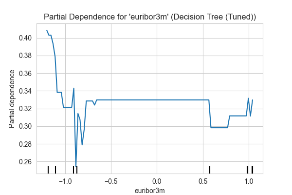

# **Executive Summary**
---
This project aims to increase long-term deposit accounts through advanced predictive analytics. I analyzed customer behavior patterns and campaign effectiveness by leveraging machine-learning techniques to optimize conversion rates.

- **Data**: 4,119 examples, 21 features, 1,230 missing entries.
- **Best Model**: Tuned SVM with **98.77%** test accuracy and **0.9973** ROC AUC.
- **Decision Tree**: Second place (**94.55%**), very fast but prone to overfitting.
- **KNN**: **90.94%** test accuracy, also near-perfect fit on training.
- **Logistic Regression**: **74.66%** accuracy, stable and interpretable, but lags behind tree/kernel-based models.

## **Recommendation**
Utilize **SVM** for best performance or **Decision Tree** for speed with minimal performance drop.  
While SVM is the champion, it’s also the slowest. Running the code on the larger dataset was canceled after over 12 hours of processing and would require distributed training or more computational resources to complete.

---

# **Data Description**
In this analysis, I explore how to predict potential subscriptions to a long-term deposit product using data from a Portuguese bank marketing campaign.  
The pipeline involves data cleaning, exploratory data analysis (EDA), various classification models, and hyperparameter tuning.

### **Dataset Overview**
- **Shape**: (4119, 21)  
- **Null Values**: 1230 missing entries  
- **Column Data Types**:  
  - 11 object (categorical)  
  - 5 int64 (integer)  
  - 5 float64 (numeric/floating)  

### **Numerical Features**  
1. `age`: Age of the customer  
2. `duration`: Last contact duration in seconds  
3. `campaign`: Number of contacts performed during this campaign  
4. `pdays`: Number of days since the client was last contacted  
5. `previous`: Number of contacts performed before this campaign  
6. `emp.var.rate`: Employment variation rate  
7. `cons.price.idx`: Consumer price index  
8. `cons.conf.idx`: Consumer confidence index  
9. `euribor3m`: Euribor 3-month rate  
10. `nr.employed`: Number of employees  

### **Categorical Features**  
1. `job`: Type of job  
2. `marital`: Marital status  
3. `education`: Education level  
4. `default`: Is credit in default?  
5. `housing`: Has a housing loan?  
6. `loan`: Has a personal loan?  
7. `contact`: Type of communication contact  
8. `month`: Last contact month  
9. `day_of_week`: Last contact day of the week  
10. `poutcome`: Outcome of the previous marketing campaign  

---

# **Exploratory Data Analysis (EDA)**

## **Class Distribution**

- **Counts**: 3,668 labeled “no” (89.05%) vs. 451 labeled “yes” (10.95%).  
- **Implication**: There is a class imbalance, so special techniques (e.g., oversampling or class weights) may be necessary.  

## **Correlation Matrix**

**Macro-Economic Cluster**  
- `emp.var.rate`, `euribor3m`, and `nr.employed` are all strongly positively correlated (in the 0.9+ range).  
- `cons.price.idx` is also notably correlated with these variables (~0.76–0.97).  
- `pdays` has an inverse correlation with `previous` (-0.59).  

**Implication**  
These clusters of features often move together, reflecting broad economic conditions. Proper modeling or feature engineering may consider these interdependencies.

---

## **Selected Categorical Features**

### **Job vs. Target**

- **High Counts**: Blue-collar, admin., and technician appear most frequently.  
- **Conversion**: Retirees and students, while fewer in number, seem to have relatively higher “yes” rates.

### **Housing vs. Target**

- **Breakdown**: ~52.80% “yes” to housing loan, ~44.65% “no.”  
- **Observation**: No strict relationship with deposit subscription alone, but it can still play a role in combination with other financial indicators.

### **Loan vs. Target**

- **Loan “no”**: Largest group; also contains the most “yes” conversions by count.  
- **Loan “yes”**: Smaller overall but includes both “no” and “yes” to the product.

---

# **Modeling Approaches**
Four classifiers were chosen to predict deposit subscription (`yes`/`no`):
1. **Logistic Regression**  
2. **Decision Tree**  
3. **K-Nearest Neighbors (KNN)**  
4. **Support Vector Machine (SVM)**  

### **Imbalanced Data Handling**
- **Upsampling**: The minority class was oversampled to address class imbalance.  
- **Train/Test Split**: 80% training data, 20% test data.

### **Evaluation Metrics**
- **Accuracy**  
- **ROC AUC**  
- **Precision, Recall, F1** (from classification reports)

---

## **Default Model Results**
| Model               | Train Time (s) | Train Accuracy | Test Accuracy | Precision | Recall | F1 Score |
|:--------------------|:--------------:|:--------------:|:-------------:|:---------:|:------:|:--------:|
| Logistic Regression | 0.08           | 0.7384         | 0.7466        | 0.8187    | 0.6335 | 0.7143   |
| Decision Tree       | 0.02           | 0.9997         | 0.9455        | 0.9017    | 1.0000 | 0.9483   |
| KNN                 | 0.00           | 0.9008         | 0.8590        | 0.7912    | 0.9755 | 0.8737   |
| SVM                 | 2.18           | 0.8062         | 0.7963        | 0.8560    | 0.7125 | 0.7777   |

**Observations**  
- **Decision Tree**: Near-perfect train accuracy, test accuracy of 0.9455, perfect recall (1.0) → likely overfitting.  
- **KNN**: Quick to train (0.00s), good recall (0.9755), test accuracy 0.8590.  
- **SVM**: Balanced but slower, 0.7963 test accuracy.  
- **Logistic Regression**: Fastest training, interpretability advantage, 0.7466 test accuracy.

---

## **Hyperparameter Tuning Results**
| Model               | Time (s) | Train Accuracy | Test Accuracy | ROC AUC  | Best Params                                                                             |
|:--------------------|:--------:|:-------------:|:-------------:|:--------:|:----------------------------------------------------------------------------------------|
| Logistic Regression | 8.62     | 0.7391        | 0.7466        | 0.7966   | {'C': 10, 'l1_ratio': 0.9, 'max_iter': 1000, 'penalty': 'elasticnet', 'solver': 'saga'} |
| Decision Tree       | 0.52     | 0.9997        | 0.9455        | 0.9458   | {'max_depth': None, 'min_samples_leaf': 1, 'min_samples_split': 2}                      |
| KNN                 | 0.22     | 0.9997        | 0.9094        | 0.9481   | {'n_neighbors': 3, 'weights': 'distance'}                                               |
| SVM                 | 58.04    | 0.9980        | 0.9877        | 0.9973   | {'C': 10, 'gamma': 1, 'kernel': 'rbf'}                                                  |

## **Model Performance Summary**
| Model             | Test Accuracy | Notable Characteristics                           |
|:------------------|:------------:|:--------------------------------------------------|
| **SVM**           | **98.77%**   | Best overall; extremely accurate; slow to train   |
| **Decision Tree** | 94.55%       | Very fast; overfits with perfect train accuracy   |
| **KNN**           | 90.94%       | Near-perfect train accuracy; decent generalization|
| **Logistic Reg.** | 74.66%       | Interpretable, stable, but lower accuracy         |

---

## **Key Insights**
1. **SVM Dominance**  
   - Achieves top test accuracy (98.77%) and highest ROC AUC (0.9973).  
   - Training can be very slow on large datasets.

2. **Decision Tree & KNN**  
   - Excellent performance (94.55%, 90.94% test accuracy).  
   - Overfitting is a concern (both ~99.97% train accuracy).

3. **Logistic Regression**  
   - Most interpretable with moderate performance.  
   - Fastest training time.

4. **Data Quality**  
   - 1,230 missing entries is significant.  
   - Better imputation or data collection may further improve performance.

5. **Feature Importance**  
   - Economic indicators (`emp.var.rate`, `euribor3m`, `nr.employed`) and `cons.price.idx` are strong predictors.  
   - `age`, `campaign`, `pdays`, and `previous` also matter.

---

## **Further Work & Considerations**
1. **Use SVM** for maximum predictive power if resources allow.  
2. **Decision Tree** is a good alternative for speed, but watch for overfitting.  
3. **Improve Data Quality**: Address missing values in `default`, `loan`, `housing`, `education`, etc.  
4. **Feature Engineering**: Combine or transform existing variables (e.g., create age groups).  
5. **Ensemble Methods** (e.g., Random Forest, XGBoost) often beat single models.  
6. **Periodic Retraining** with updated data is important, especially for economic-related features.

---

**Report Generated:** 2025-01-01 18:32:36  
*(End of Main Report)*

---

# **Tuned Models and Their Visualizations**

Below are the final, tuned versions of our models, each with:
1. **Permutation Feature Importance**  
2. **Partial Dependence Plots**  
3. **Confusion Matrix**  
4. **ROC Curve**  
5. **Precision–Recall Curve**  

These help us understand **how** each model arrives at its predictions and **why** certain features matter more than others.

---

## **1. Logistic Regression (Tuned)**

### **A) Permutation Feature Importance**
")

- **Interpretation**:  
  - Economic variables like `emp.var.rate` and `cons.price.idx` heavily influence predictions.  
  - `contact_telephone` and `poutcome_success` also show moderate importance.  
  - Higher bars indicate stronger influence on prediction probability.

### **B) Partial Dependence Plots**

1. **`emp.var.rate`**  
   
   - **Interpretation**:  
     - Subscription probability peaks around moderate negative values for `emp.var.rate`.  
     - More extreme negative or positive rates reduce the likelihood of a “yes.”

2. **`cons.price.idx`**  
   
   - **Interpretation**:  
     - Mid-range consumer price indices correlate with higher predicted probability.  
     - Very low or very high `cons.price.idx` values drive probabilities lower.

### **C) Confusion Matrix**
")

- **Interpretation**:
  - Shows how many “yes” vs. “no” predictions align with actual labels.  
  - Diagonal cells represent correct predictions, off-diagonal cells represent misclassifications.  

### **D) ROC Curve**
")

- **Interpretation**:  
  - An AUC near 0.80 (from previous table) indicates moderately good separation.  
  - The curve’s slope suggests good performance at a reasonable threshold but not as strong as tree-based or SVM models.

### **E) Precision–Recall Curve**
")

- **Interpretation**:  
  - Demonstrates trade-offs between precision and recall across different probability thresholds.  
  - Maintains decent precision for a broad range of recall but lower than SVM or Decision Tree.

---

## **2. Decision Tree (Tuned)**

### **A) Permutation Feature Importance**
")

- **Interpretation**:  
  - `euribor3m`, `nr.employed`, and `age` are among the top drivers for the Decision Tree.  
  - `campaign` and `cons.conf.idx` also show notable importance.

### **B) Partial Dependence Plots**

1. **`age`**  
   
   - **Interpretation**:  
     - Middle-aged segments may exhibit higher probability of subscribing compared to very young or older customers.

2. **`campaign`**  
   
   - **Interpretation**:  
     - Making too many calls (campaign > ~3 or 4) can lower the subscription probability, indicating potential fatigue.

3. **`cons.conf.idx`**  
   
   - **Interpretation**:  
     - Moderately negative consumer confidence index appears to yield a higher subscription chance than extreme lows.

4. **`euribor3m`**  
   
   - **Interpretation**:  
     - Higher euribor rates typically correlate with a lower predicted probability of subscription.

5. **`nr.employed`**  
   
   - **Interpretation**:  
     - Larger workforce numbers can depress subscription likelihood, possibly due to broader economic conditions.

### **C) Confusion Matrix**
")

- **Interpretation**:
  - Very high number of correct “no” and “yes” classifications (diagonal).  
  - Overfitting remains possible given near-perfect training accuracy.

### **D) ROC Curve**
")

- **Interpretation**:  
  - Strong curve reflecting high true-positive rates.  
  - AUC (~0.9458) is excellent but slightly behind SVM.

### **E) Precision–Recall Curve**
")

- **Interpretation**:  
  - Near-perfect recall for a wide range of thresholds, with precision staying relatively high.  
  - Reinforces that the tuned Decision Tree rarely misses positive cases.

---

## **3. KNN (Tuned)**

### **A) Permutation Feature Importance**
")

- **Interpretation**:  
  - `age`, `pdays`, `campaign`, and `cons.conf.idx` drive predictions in KNN.  
  - KNN relies on distance metrics; thus, numeric variables (age, pdays) are typically quite influential.

### **B) Partial Dependence Plots**

1. **`age`**  
   
   - **Interpretation**:  
     - Similar to other models, mid-range age groups show a higher likelihood of subscription.

2. **`campaign`**  
   
   - **Interpretation**:  
     - Fewer contacts (1–3) correlates with higher success. Excessive contacts can reduce conversion rates.

3. **`cons.conf.idx`**  
   
   - **Interpretation**:  
     - A less negative confidence index (around -36 to -38) is associated with increased subscription probability.

4. **`pdays`**  
   
   - **Interpretation**:  
     - If the client was contacted very recently (pdays < ~5), the success chance is higher than if it was a long gap (999).

5. **`previous`**  
   
   - **Interpretation**:  
     - More previous contacts slightly raises success probability but plateaus quickly.

### **C) Confusion Matrix**
")

- **Interpretation**:
  - High recall, meaning few missed “yes” cases.  
  - KNN can misclassify some “no” as “yes” (off-diagonal), but overall strong performance.

### **D) ROC Curve**
")

- **Interpretation**:  
  - AUC ~0.9481, indicating robust separation between positive and negative classes.  
  - Slightly below Decision Tree and SVM, but still quite good.

### **E) Precision–Recall Curve**
")

- **Interpretation**:  
  - High recall across many thresholds.  
  - Precision is slightly lower at the extreme recall region but remains competitive.

---

## **4. SVM (Tuned)**

### **A) Permutation Feature Importance**
")

- **Interpretation**:  
  - The top features for SVM include `nr.employed`, `age`, `cons.conf.idx`, and `cons.price.idx`—all strong indicators of economic and demographic conditions.  
  - Categorical encodings such as `marital_married`, `housing_yes`, and `education_university.degree` also appear highly important.  
  - Higher bars indicate stronger influence on predictions.

### **B) Partial Dependence Plots (PDPs)**

1. **`emp.var.rate`**  
   
   - **Interpretation**:  
     - The model predicts higher probabilities of subscription when `emp.var.rate` is in a moderate negative range (~ -1.0 to -0.5).  

2. **`nr.employed`**  
   
   - **Interpretation**:  
     - Slight dips in `nr.employed` around 0 to -0.5 lead to lower probabilities, while more negative or moderate values can push probabilities higher.

3. **`age`**  
   
   - **Interpretation**:  
     - Ages roughly in the mid-30s to early 40s correlate with the highest predicted probability of subscription.

4. **`cons.conf.idx`**  
   
   - **Interpretation**:  
     - Moderate confidence index values correspond to higher probabilities.

5. **`cons.price.idx`**  
   
   - **Interpretation**:  
     - A bimodal range around -0.5 and +0.5 is associated with increased subscription probability.

### **C) Confusion Matrix**
")

- **Interpretation**:
  - Very few misclassifications; the SVM captures nearly all “yes” and “no” correctly.  
  - Reflects the highest test accuracy (98.77%) among all models.

### **D) ROC Curve**
")

- **Interpretation**:  
  - The curve hugs the top-left corner, indicating excellent discrimination between classes.  
  - **AUC = 0.9973** underscores near-perfect separation.

### **E) Precision–Recall Curve**
")

- **Interpretation**:  
  - The curve remains high (>0.90 precision) over a broad range of recall values.  
  - **AP ~0.9853** signals strong ability to capture positives without many false positives.

---

## **Summary of Tuned Models**
- **Logistic Regression**: Most interpretable, moderate performance (~74.66%).
- **Decision Tree**: High accuracy (~94.55%), extremely fast, but risk of overfitting.
- **KNN**: Balances good accuracy (~90.94%) with quick training but can still misclassify some “no” as “yes.”
- **SVM**: Best overall at ~98.77% accuracy, but slow and resource-intensive.

Overall, **SVM (Tuned)** and **Decision Tree (Tuned)** provide top performance, with SVM edging out the others in accuracy and AUC. However, the Decision Tree’s speed may be advantageous if computing resources are limited or if the dataset scales significantly.

*(End of Full Report)*
